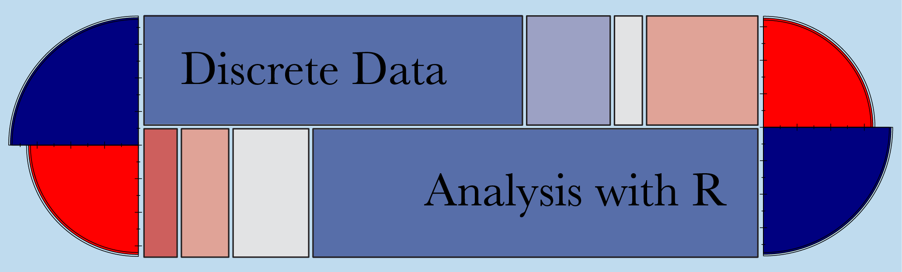
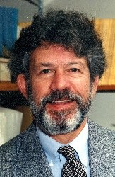

---
output:
  html_document
---

Home | Content | Using the book | Other materials | Authors

## Authors

### Michael Friendly

Michael Friendly is a professor of psychology, founding chair of the Graduate Program in Quantitative Methods, and an associate     coordinator with the [Statistical Consulting Service](http://www.yorku.ca/isr/scs/) at York University. He earned a PhD in psychology from Princeton University, specializing in psychometrics and cognitive psychology. 

In addition to his research interests in psychology, Professor Friendly has broad experience in data analysis, statistics, and computer applications. His main research areas are the development of graphical methods for categorical and multivariate data and the history of data visualization. He is an associate editor of the *Journal of Computational and Graphical Statistics* and *Statistical Science*.

### David Meyer

David Meyer is a professor of business informatics at the [University of Applied Sciences Technikum Wien](http://www.technikum-wien.at/). He earned a PhD in business administration from the Vienna University of Economics and Business, with an emphasis on computational economics. Dr. Meyer has published numerous papers in various computer science and statistical journals. His research interests include R, business intelligence, data mining, and operations research.