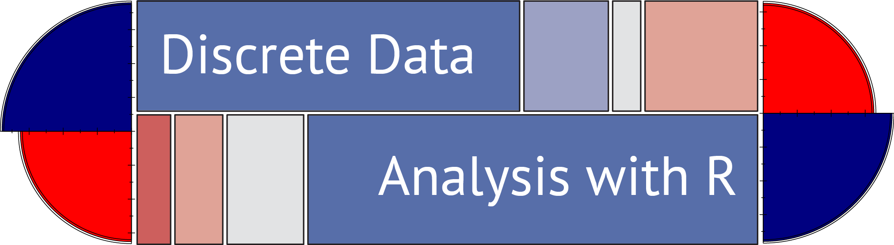

---
output:
  html_document
---


Home | Content | Using the book | Other materials | Authors

## R packages

There are quite a few R packages used in the book.
To prepare your R installation for running *all* the examples in this book, you can use the following commands to install
these packages.

```{r install1, eval=FALSE, tidy=TRUE}
packages <- c(
  "AER", "ca", "car", "colorspace", "corrplot", "countreg", "directlabels", "effects", "ggparallel", "ggplot2", "ggtern", "gmodels", "gnm", "gpairs", "heplots", "Lahman", "lattice", "lmtest", "logmult", "MASS", "mgcv", "nnet", "plyr", "pscl", "RColorBrewer", "reshape2", "rms", "rsm", "sandwich", "splines", "vcd", "vcdExtra", "VGAM", "xtable")
install.packages(packages)
```

The `countreg` package, used in Chapter 11, may not yet be available on [CRAN](http://cran.r-project.org).
If not, you can install it from the R-Forge development site.

```{r install2, eval=FALSE}
# if countreg is not yet on CRAN:
install.packages("countreg", repos="http://R-Forge.R-project.org")
```

