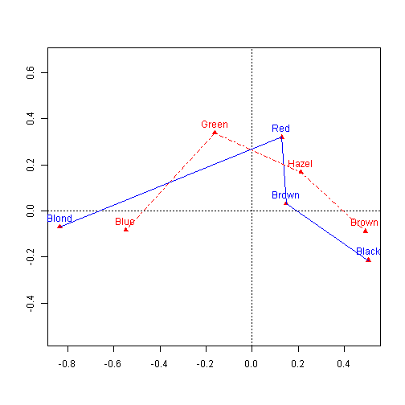
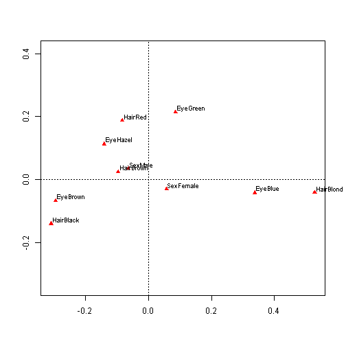

Issues using the ca package
========================================================


In VCDR, I'd like to try to explain correspondence analysis
visually as much as possible, both with well-constructed
plots of good data examples used elsewhere in the book
and with some conceptual diagrams for constructed data.

I would like to do this, as much as possible with the ca
package which, AFAICS provides the most general implementation
in R, in terms of computations.

In the SAS version of the book, this was all relatively 
easy because the CORRESP procedure carried out the
computations for all the cases (CA, MCA) and returned
output data sets in a convenient form for drawing customized
graphs.

However, I keep running into walls trying to do similar things
using the `ca` package.  Some of these are relatively easy
to fix, and I've already done some of them, using what is
now v. 0.55 that I've enhanced several times.

Done
----

* Because the plot. functions calculate the coordinates of the row/col points plotted, it  is necessary for the functions to return the coordinates plotted if one is to do further annotations, like drawing lines, adding additional text or symbols, etc.

* For `ca`, options need to be provided for the colors of point labels as well as for point symbols.

TODO
----

### General:

* The output objects returned by `ca` and `mcja` should _all_ have
appropriate labels, particularly for matrices, using rownames and colnames.  I did this for the `rowcoord` and `colcoord` from ca(), but, for example, if I want to display the Burt matrix from `mjca`, the result is hard to understand w/o appropriate row/col labels.

* The `print` and `summary` methods seem designed to reproduce results from Michael's books or other software, and the code is all quite obtuse and inflexible.  For example, for a very basic summary display of a CA/MCA analysis, I favor just using the scree plot portion of the summary() method.  But in the book, I have to use a custom chunk hook to subset the output to only this.  I looked at the code for the print and summary methods and decided that it would have to be totally re-written to be
more flexible.  I suppose I could just add a `scree()` function to do what I want here.

More generally, there are no extractor functions for `ca` or `mjca`
objects as available for other statistical methods.  For example, following standard R conventions,
a `coef.ca()` method (or it could be called `coord.ca()`) could be used to extract the coordinates
from a ca object.  For example, here is a coef method I use in the `candisc` package:


```r
## coef method for a candisc object
coef.candisc <- function(object, type = c("std", "raw", "structure"), ...) {
    type <- match.arg(type)
    switch(type, std = object$coeffs.std, raw = object$coeffs.raw, structure = object$structure)
}
```

Doing this would allow moving some of the messy code outside the `ca` and `mjca` functions
as well. 

### ca / plot.ca

* `ca` works only with two-way frequency tables.  Following the design of `MASS::corresp`, it would be more convienient to make `ca` a generic function, with S3 methods for other types of input.  The curren `ca` in this scheme could become `ca.default`.


```r
library(MASS)
methods("corresp")
```

```
## [1] corresp.data.frame* corresp.default*    corresp.factor*    
## [4] corresp.formula*    corresp.matrix*     corresp.xtabs*     
## 
##    Non-visible functions are asterisked
```


### mcja / plot.mjca

* `mjca` requires a data.frame in _case form_, with all factor variables, which is inconvenient for most examples of categorical data analysis in R, where the data is usually stored in tables, or data frames in frequency form, i.e., with a `count` or `Freq` variable.  E.g., the analysis of hair color and eye color in the `HairEyeColor` data requires two steps:


```r
data(HairEyeColor)
haireye <- margin.table(HairEyeColor, 1:2)  # table form
haireye.df <- as.data.frame(haireye)  # frequency form
str(haireye.df)
```

```
## 'data.frame':	16 obs. of  3 variables:
##  $ Hair: Factor w/ 4 levels "Black","Brown",..: 1 2 3 4 1 2 3 4 1 2 ...
##  $ Eye : Factor w/ 4 levels "Brown","Blue",..: 1 1 1 1 2 2 2 2 3 3 ...
##  $ Freq: num  68 119 26 7 20 84 17 94 15 54 ...
```

```r
library(vcdExtra)
```

```
## Loading required package: vcd
## Loading required package: grid
## Loading required package: gnm
```

```
## Warning: package 'gnm' was built under R version 3.0.2
```

```r
haireye.df <- expand.dft(haireye.df)  # case form
str(haireye.df)
```

```
## 'data.frame':	592 obs. of  2 variables:
##  $ Hair: Factor w/ 4 levels "Black","Blond",..: 1 1 1 1 1 1 1 1 1 1 ...
##  $ Eye : Factor w/ 4 levels "Blue","Brown",..: 2 2 2 2 2 2 2 2 2 2 ...
```

Then one can use `mjca` on the case form data frame:


```r
library(ca)
haireye.mca <- mjca(haireye.df)
summary(haireye.mca)
```

```
## 
## Principal inertias (eigenvalues):
## 
##  dim    value      %   cum%   scree plot               
##  1      0.208773  89.4  89.4  *************************
##  2      0.022227   9.5  98.9  **                       
##  3      0.002598   1.1 100.0                           
##         -------- -----                                 
##  Total: 0.233598                                       
## 
## 
## Columns:
##          name   mass  qlt  inr    k=1 cor ctr    k=2 cor ctr  
## 1 | HairBlack |   91  990  135 |  505 838 111 | -215 152 189 |
## 2 | HairBlond |  107 1000  145 | -835 993 359 |  -70   7  23 |
## 3 | HairBrown |  242  906   82 |  148 864  25 |   33  42  12 |
## 4 |   HairRed |   60  945  138 |  130 133   5 |  320 812 276 |
## 5 |   EyeBlue |  182 1000  116 | -547 977 261 |  -83  22  56 |
## 6 |  EyeBrown |  186  998  112 |  492 967 216 |  -88  31  65 |
## 7 |  EyeGreen |   54  948  140 | -162 176   7 |  339 773 280 |
## 8 |  EyeHazel |   79  879  132 |  213 542  17 |  167 336  99 |
```


__Recommendation:__ Ideally, `mjca` should be able to handle input in
both table form and frequency form internally, by doing the steps shown above.  Rather than modifying
`mjca` internally, the R way is to make it generic, renaming the current version `mjca.default`
and provide S3 methods like `mjca.table`, `mjca.data.frame`, etc.

* The output structures from both `mjca` and `plot.mjca` limit my ability to make the kinds of plots I would like, for a variety of reasons, but the principal one is that the factor _names_ and the factor _level values_ are combined via `paste(factor, level, sep="")` into strings for plotting that are difficult to separate for even simple plot customization.

For example, I found it hard to change the default plot for mcja to
use only the level names, and distinguish the factors by color.
The following code does what I want for one plot, but it too ugly
to include in the text, no less try to explain to a reader why it
is necessary, or how to do it with his/her data.


```r
# plot, but don't use point labels
res <- plot(haireye.mca, labels=0)

coords <- res$cols
# simplify point labels, for display purposes
rownames(coords) <- gsub("Hair|Eye", "", rownames(coords))
text(coords, rownames(coords), col=rep(c("blue", "red"), each=4), pos=3)

coords[1:4,] <- coords[order(coords[1:4,1]),] 
coords[5:8,] <- coords[4+order(coords[5:8,1]),]
lines(coords[1:4,], lty=1, col="blue")
lines(coords[5:8,], lty=4, col="red")
```

 

You may not like the use of lines connecting categories in MCA plots (as I do), but this is really
just an argument for "let them do it, if they want to".

For the 3-way table, this is even harder:

```r
# 3-way table
HEC.df <- expand.dft(as.data.frame(HairEyeColor))
HEC.mca <- mjca(HEC.df)
summary(HEC.mca)
```

```
## 
## Principal inertias (eigenvalues):
## 
##  dim    value      %   cum%   scree plot               
##  1      0.054579  65.6  65.6  *************************
##  2      0.006263   7.5  73.1  ***                      
##  3      0.000871   1.0  74.1                           
##         -------- -----                                 
##  Total: 0.083229                                       
## 
## 
## Columns:
##           name   mass  qlt  inr    k=1 cor ctr    k=2 cor ctr  
## 1  | HairBlack |   61  738  117 | -310 613 107 | -140 125 191 |
## 2  | HairBlond |   72  745  126 |  527 741 364 |  -41   5  19 |
## 3  | HairBrown |  161  691   71 |  -97 648  27 |   25  43  16 |
## 4  |   HairRed |   40  667  119 |  -84 111   5 |  187 556 224 |
## 5  |   EyeBlue |  121  754  100 |  337 742 252 |  -42  12  35 |
## 6  |  EyeBrown |  124  724   96 | -295 688 198 |  -68  37  92 |
## 7  |  EyeGreen |   36  677  121 |   86  95   5 |  214 582 262 |
## 8  |  EyeHazel |   52  739  114 | -141 453  19 |  112 286 105 |
## 9  | SexFemale |  176  588   64 |   57 456  11 |  -31 132  27 |
## 10 |   SexMale |  157  588   72 |  -64 456  12 |   35 132  30 |
```

```r

res3 <- plot(HEC.mca)
```

 

```r
res3
```

```
## $rows
##      Dim1 Dim2
## <NA>   NA   NA
## 
## $cols
##               Dim1     Dim2
## HairBlack -0.30957 -0.14007
## HairBlond  0.52730 -0.04132
## HairBrown -0.09650  0.02477
## HairRed   -0.08357  0.18721
## EyeBlue    0.33733 -0.04242
## EyeBrown  -0.29503 -0.06808
## EyeGreen   0.08615  0.21353
## EyeHazel  -0.14121  0.11217
## SexFemale  0.05715 -0.03077
## SexMale   -0.06412  0.03452
```


__Recommendation:__ Minimally, `mjca` should construct the names for factor-level combinations in the form `paste(factor, level, sep=sep)` where `sep` is an input argument like `"."` or `":"` by default. The value `sep=""` would give the present behavior.

`MASS::corresp` also provides an argument `abbrev`, where `abbrev=TRUE` means that the names are abbreviated to just the level value, which will suffice if the level values are all distinct.

More generally, this would all be much easier if the output object(s) from `mjca` were re-designed
so that the factor and level values appeared in separate columns of a __data frame__.  Using my example above, this would look something like the following:

```r
coords2 <- as.data.frame(res$cols)
coords2$factor <- rep(c("Hair", "Eye"), each = 4)
coords2$level <- gsub("Hair|Eye", "", rownames(coords2))
coords2
```

```
##              Dim1     Dim2 factor level
## HairBlack  0.5046 -0.21482   Hair Black
## HairBlond -0.8353 -0.06958   Hair Blond
## HairBrown  0.1483  0.03267   Hair Brown
## HairRed    0.1295  0.31964   Hair   Red
## EyeBlue   -0.5474 -0.08295    Eye  Blue
## EyeBrown   0.4922 -0.08832    Eye Brown
## EyeGreen  -0.1618  0.33904    Eye Green
## EyeHazel   0.2126  0.16739    Eye Hazel
```


